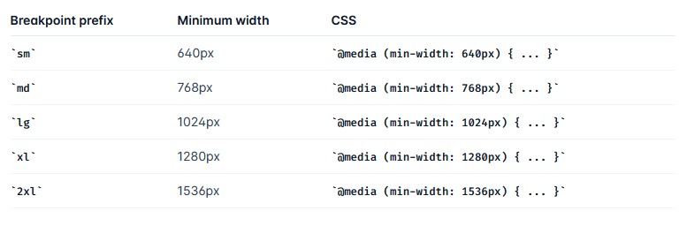

<!-- This template should help get you started developing with Vue 3 in Vite.

## Recommended IDE Setup

[VSCode](https://code.visualstudio.com/) + [Volar](https://marketplace.visualstudio.com/items?itemName=Vue.volar) (and disable Vetur) + [TypeScript Vue Plugin (Volar)](https://marketplace.visualstudio.com/items?itemName=Vue.vscode-typescript-vue-plugin).

## Type Support for `.vue` Imports in TS

TypeScript cannot handle type information for `.vue` imports by default, so we replace the `tsc` CLI with `vue-tsc` for type checking. In editors, we need [TypeScript Vue Plugin (Volar)](https://marketplace.visualstudio.com/items?itemName=Vue.vscode-typescript-vue-plugin) to make the TypeScript language service aware of `.vue` types.

If the standalone TypeScript plugin doesn't feel fast enough to you, Volar has also implemented a [Take Over Mode](https://github.com/johnsoncodehk/volar/discussions/471#discussioncomment-1361669) that is more performant. You can enable it by the following steps:

1. Disable the built-in TypeScript Extension
   1. Run `Extensions: Show Built-in Extensions` from VSCode's command palette
   2. Find `TypeScript and JavaScript Language Features`, right click and select `Disable (Workspace)`
2. Reload the VSCode window by running `Developer: Reload Window` from the command palette.

## Customize configuration

See [Vite Configuration Reference](https://vitejs.dev/config/).

## Project Setup

```sh
npm install
```

### Compile and Hot-Reload for Development

```sh
npm run dev
```

### Type-Check, Compile and Minify for Production

```sh
npm run build
```

### Run Unit Tests with [Vitest](https://vitest.dev/)

```sh
npm run test:unit
```

### Lint with [ESLint](https://eslint.org/)

```sh
npm run lint
``` -->

# Shadow Boxing Workout

_As a boxing enthusiast and adept, I wanted to create a training app based on the most common boxing training - shadow boxing. It was intended to allow users at any level to work on punch combinations, footwork or reflexes even more effectively. The original idea has been developed with additional features to cater to a wider range of users._


# General Info

## Project

A simple platform for those training in boxing or other combat sports aimed at supporting users' training and sports development; building a community and as a source of knowledge and information about the world of boxing.

## Main Elements And Features Included:

- The Core - **Shadow Boxing Workout:** Boxing training sessions divided into levels of difficulty;
- **Weight Monitor:** Recording weight measurements and displaying historical records in a chart format;
- **Blogs:** User blog section (_to be implemented in further stages of project development_);
- **E-commerce Store** Store offering clothing and accessories for combat sports enthusiasts (_to be implemented in further stages of project development_).

## Programming Goals And Assumptions:

- **From Scratch to Deployment:** The project aims to build a comprehensive application from the ground up, considering my level of knowledge and experience, based on one of the JavaScript frameworks;
- **Efficient Styling**;
- **Utilizing the cloud platform for handling authentication and user data storage**;
- **Utilizing TypeScript**;
- **Version control and tracking changes in the project**;
- **Responsive Design**;
- **Accessibility**;
- **Unit Testing**;
- **Clean Code**;

## Tech Stack

Built with:

- **Vue.js**,
- **Pinia**,
- **Vue Router**,
- **Vite**,
- **Vitest**,
- **Firebase**,
- **Tailwind CSS**,
- **Typescript**,
- **Vuelidate**,
- **Chart.js**.

# Results linked to set objectives.

### 'From Scratch to Deployment':

The project was created using **Vue.js** and related libraries and tools such as:

- **Pinia**,
- **Vue Router**,
- **Vite**, etc.

It is the result of independent work from the idea through the structure, selection of tools and design solutions and their implementation. It is a summary of the consecutive stages of learning programming and an introduction to working with **NUXT**, which is the next designated step.

### 'Efficient Styling':

After learning about _Bootstrap_, _Sass_, _BEM_, I decided to use **Tailwind CSS** (https://tailwindcss.com/) for this project. The app is fully styled using Tailwind's built-in CSS classes, with no additional CSS classes (scope nor global).

In addition, extensions have been created for the custom colors used in the app and a font from Google Fonts has been added. Keyframes were also added and animations were defined. All this allows for better management and easier changes to the code.
Examples of my extensions:

```[tailwind.config.ts]
      colors: {
        'custom-white': '#E7E4DF',
        'custom-black': '#141414',
        'custom-grey': '#808080',
        'custom-orange-light': '#ed762f',
        'custom-orange-dark': '#ec642b'
      },
      keyframes:{
        (...),
        'show-down': {
          '0%': {
            transform: 'translateY(-100%)',
            'clip-path': 'inset(100% 0 0 0)'
          },
          '100%': {
            transform: 'translateY(0)',
            'clip-path': 'inset(0)'
          },
        (...)
        },
      },
      animation:{
        (...)
        'appear-slow-and-delayed': 'appearance 1s linear 700ms both',
        (...)
      }
```

### 'Utilizing the cloud platform for handling authentication and user data storage':

High popularity, good quality documentation and numerous resources and tutorials led me to use the **Firebase** platform (https://firebase.google.com/). The project uses **Authentification**. **Firebase Storage** and **Firestore Database** products. The built-in authentification features combined with Pinia allowed me to easily create and save user accounts in the database, log in, reset passwords...

#### Authentification

```AuthentificationStore.ts:
actions: {
    // sign up anonymously with firebase
    async getAccessAsAnAnonymous(): Promise<void> {
      try {
        await signInAnonymously(firebaseAuth)
      } catch (error: unknown) {
        this.errorsHandling(error)
      }
    },

    // sign up user via form
    async createUser(email: string, password: string, displayName: string): Promise<void> {
      try {
        const userCredential = await createUserWithEmailAndPassword(firebaseAuth, email, password)
        await updateProfile(userCredential.user, { displayName: displayName })
        await sendEmailVerification(userCredential.user)
      } catch (error: unknown) {
        this.errorsHandling(error)
      }
    },

    // sign in user via form
    async signInUser(email: string, password: string): Promise<void> {
      if (!this.user) {
        try {
          const userCredential = await signInWithEmailAndPassword(firebaseAuth, email, password)
          const authenticatedUser = userCredential.user
          if (authenticatedUser && authenticatedUser.emailVerified) {
            this.user = authenticatedUser
          } else {
            throw new Error('User not authenticated or email not verified.')
          }
        } catch (error: unknown) {
          this.errorsHandling(error)
        }
      }
    },

    // log out current user with firebase
    async logoutUser(
      routerPush: (location: string | RouteLocationNamedRaw) => void
    ): Promise<void> {
      try {
        await signOut(firebaseAuth)
        routerPush({ name: 'home' })
      } catch (error: unknown | FirebaseError) {
        this.errorsHandling(error)
      }
    },
}
```

Firebase helps differentiate the availability of functionality for logged-in and anonymous users, for example rendering/not rendering nav items depending on user status.

```AuthentificationStore.ts:
    async checkUserAuthState() {
      onAuthStateChanged(firebaseAuth, (user) => {
        if (user !== null && (user.emailVerified || user.isAnonymous)) {
          this.user = user
        } else {
          this.user = null
        }
        this.authCompleted = true
      })
    },

```

```ShadowBoxingLink.vue:
  <router-link
    v-if="authStore.user"
    :to="{ name: 'shadow-boxing', params: { userId: authStore.user.uid } }"
  >
    Shadow Boxing
  </router-link>
```

Created Users accessibility categories:

- **Full Access:** For registered users, the ability to get and post weight measurements and training results, _make purchases, save favorite blogs, posts, or create content_(_to be implemented in further stages of project development_).
- **Limited Access:** For users without registration, no access to shadow boxing features, weight monitor, _purchasing (only browsing), saving favorite blogs (only browsing), posts, or creating content_(_to be implemented in further stages of project development_).
- **Try As Guest:** A temporary "Try As Guest" access option has been created to allow interested users to shorten the authentication path and provide access to all functionalities - weight measurements, shadow boxing sessions, etc. The data won't be be stored in the database but only in local memory.

#### Firestore Database

Saving & getting training sessions data or weight monitor measurements:

```WeightInput.vue:
// submit weight value to firebase user's data collection
const populateWeights = async (): Promise<void> => {
  const user = authStore.user
  if (user && weightInput.value && weightInput.value > 0) {
    try {
      // according to firebase docs: function creates records in 'measurements' folder
      const measurementsCollection = collection(db, 'users', user.uid, 'measurements')
      // record keeps weight value & date of creation
      await addDoc(measurementsCollection, { weight: weightInput.value, date: new Date() })
    } catch (error) {
      console.error('Error from WeightInput:', error)
    }
  }
  weightInput.value = null
}
```

```WeightMonitorView.vue:
const getMeasures = async (): Promise<void> => {
  if (authStore.user != null) {
    const measurementsCollection = collection(db, 'users', authStore.user.uid, 'measurements')
    q = query(measurementsCollection, orderBy('date'))
    try {
      const querySnapshot = await getDocs(q)
      measurements.value = mapSnapshot(querySnapshot.docs)
    } catch (error) {
      console.error('getMeasures error: ' + error)
    }
  }
}
```

```AdvancedTrainingDisplay.vue:
// submit session details to firebase user's data collection
const saveAndCloseSession = async (): Promise<void> => {
  const user = authStore.user
  if (user && advTrainingStore.status === 'done') {
    try {
      // according to firebase docs: function creates records in 'trainings' folder
      const trainingCollection = collection(db, 'users', user.uid, 'trainings')
      await addDoc(trainingCollection, {
        training: 'advanced',
        rounds: advTrainingStore.rounds,
        complexity: advTrainingStore.complexity,
        intensity: advTrainingStore.intensity,
        // record keeps weight value & date of creation
        date: new Date()
      })
    } catch (error) {
      console.error('Saving Advanced Training Session Error:' + error)
    }
  }
  console.log('Session end! Saving')
}
```

#### Storage

Getting audio-command files from firebase. I mixed the way that audio files are stored and used - For 'basic' session it's stored in 'assets' folder. For 'advanced' session it's stored and downloaded from firebase storage. I did it on purpose to try both ways and see how it influence on the performance. I'm considering to store all audio files on firebase storage.

```advancedAudioCombinationsHandler.ts:
const getAudioFiles = async (): Promise<void> => {
  try {
    const audioFiles = await listAll(folderRef)
    for (const itemRef of audioFiles.items) {
      try {
        const url = await getDownloadURL(itemRef)
        combinationsArray.push(url)
      } catch (error) {
        console.error('Error downloading advanced combinations audio files:' + error)
      }
    }
  } catch (error: unknown) {
    console.error('Error listing files:' + error)
  }
}
```

For "Create an account" form I used Vuelidate (https://vuelidate-next.netlify.app/) - lightweight model-based validation dedicated for Vue.js.
Vuelidate comes with a set of validators which I set up in the code.
Validators I used are responsible for matching values of password and password-confirmation property, email input control, required min. length:

```SignUpForm.vue:

// validation rules (due to Vuelidate docs)
const validationRules = computed(() => {
  return {
    displayName: { required, alphaNum, minLength: minLength(2) },
    email: { required, email },
    password: {
      password: {
        required,
        minLength: minLength(8)
      },
      confirm: { required, sameAs: sameAs(userData.password.password) }
    }
  }
})

```

This validator also helps to generate error messages displayed to the user.$touch method and @blur event causing that error only shows up after user entered and left the input.

```SignUpForm.vue:

  // for email / with validation
  {
    title: 'email',
    blur: () => v$.value.email.$touch(),
    id: 'email',
    value: userData.email,
    type: 'email',
    placeholder: 'rocky.balboa@mail.com',
    error: () => v$.value.email.$error,
    errorMessage: () => v$.value.email.$errors[0].$message
  },

```

It also helps to avoid sending incorrect or empty form to Firebase:

```SignUpForm.vue:

  // check if no vuelidate errors or empty fields before sending request to firebase
  if (!v$.value.$error || !v$.value.$invalid) return

```

### 'Utilizing TypeScript':

TypeScript is now a 'must have' for any programmer writing in JavaScript. Working on this project was an opportunity to learn and use it in a real project. I used basic elements such as:

- Type Annotation.
  Type annotations are crucial as they provide greater typing certainty and helped me avoid errors related to data types. In this project, I used type annotations to declare data types for variables, making it easier to understand their intentions and preventing errors during programming.
  For example, in the BasicTrainingModal.vue file, type annotation is used to declare the data type for the punchesArray array:

```
const punchesArray: string[] = [
  'jab',
  'cross',
  'lead hook',
  'rear hook',
  'lead uppercut',
  'rear uppercut'
]
```

- Interfaces are used in the project mainly to define data structures and improve code readability and maintainability. By defining interfaces for different data types, such as quotes or user data, I was able to clearly specify which properties should be present in objects implementing these interfaces.
  For example, in the quotes.ts file, the Quote interface defines the data structure for a quote, containing the quote and author fields:

```
interface Quote {
  quote: string
  author: string
}
```

- Type guards are essential in the project for handling various data types, including errors related to the Firebase service. With type guards, I was able to safely handle different data cases and prevent errors caused by type inconsistencies.
  For example, in the AuthentificationStore.ts file, the errorsHandling function uses a type guard to check if the error is an instance of FirebaseError:

```
    errorsHandling(error: unknown | FirebaseError) {
      if (error instanceof FirebaseError) {
        console.error('Firebase Error:', error.code, error.message)
        switch (error.code) {...}
      } else {
        console.error('Unexpected Error:', error)
        switch (error) {...}
        throw new Error('Unexpected Error')
      }
    }
```

- Union types are used in the project to handle different use cases and conditions that may arise. They allow to specify a variable or function parameter that can have multiple possible types.
  For example, in the BasicTrainingModal.vue file, the intervalId variable is of type union number | null, meaning it can hold either a numeric value or null:

```
const intervalId = ref<number | null>(null)
```

- Generics are used in the project to create more generic and reusable components, functions, or classes. Thanks to Generics I was able to write code that can operate on different data types, contributing to code flexibility and reusability:

```
interface WeightGraphProps {
  measurements: WeightData[]
}
const props = defineProps<WeightGraphProps>()

```

### 'Version control and tracking changes in the project':

- I used Git for version control to organize the source code.
- Repository link: https://github.com/TomekLeszczynski/Shadow-Boxing-App.
- Since it's my personal project and there were no other persons involved, I decided to create only one branch. I didn't use any pull requests, but I reviewed changes locally using Source Control.
- The repository was regularly updated with clear and descriptive commits.
- Git Lens and built-in Source Control were used for the respository management.
- The project includes a .gitignore file to ignore Firebase configuration data. Additionally, an .env.example file was included to indicate the configuration structure to other developers.

### 'Responsive Design':

Responsive interfaces build with Tailwind CSS default breakpoints (https://tailwindcss.com/docs/responsive-design):


I've also added an extra prefix since I found it helpfull to control fonts size on the smallest screens:

```[tailwind.config.ts]
screens: {
        xs: '475px'
      },
```

Responsiveness tested on web browsers as follows:

- Google Chrome ver: (to add)
- Firefox ver: (to add)
- Microsoft Edge ver: (to add)
- Brave ver: (to add)


### 'Accessibility':

<!-- TO UPDATE -->

<!-- Opisać aria-hidden="true" czyli obrazek jako dekoracja -->

### 'Unit Testing':

<!-- TO UPDATE -->

### 'Clean Code':

<!-- TO UPDATE -->

# Issues & Conclusions

<!-- Remove sinced v-for loop is used -->

#### V-model & V-for

I found it quite difficult to solve the problem of using a v-model inside a v-for loop. I tried to reduce the code for the input data in LoginForm or SignUpForm. Finally I decided to leave it as is even though I am repeating the code.

```[LoginForm.vue]
    <!-- EMAIL & INPUTS -->
    <div class="flex flex-col animate-text-show-up">
      <label for="email" class="my-3 text-xl">Email</label>
      <input
        id="email"
        type="email"
        v-model.lazy="email"
        class="h-10 bg-custom-white border-none px-5 placeholder:text-custom-black text-custom-black"
        placeholder="rocky.balboa@mail.com"
      />
    </div>

    <!--  PASSWORD INPUT -->
    <div class="flex flex-col animate-text-show-up">
      <label for="password" class="my-3 text-xl">Password</label>
      <input
        id="password"
        type="password"
        v-model.lazy="password"
        class="h-10 bg-custom-white border-none px-5 placeholder:text-custom-black text-custom-black"
        placeholder="********"
      />
    </div>
```

# Design Inspirations

#### Webpages

<a href="https://aim.obys.agency/" target="_blank" rel="noopener"></a>
<a href="https://memphis.it/en/" target="_blank" rel="noopener"></a>
<a href="https://www.eclipse.builders/" target="_blank" rel="noopener"></a>

#### Elements

- https://css-tricks.com/animating-with-clip-path/

#### Icons, Graphics & Photos

- Icons:
  - https://heroicons.com/
  - https://www.flaticon.com/
- Graphics & Photos:
  - https://unsplash.com/
  - punch-figures used in basic training are presented and processed by myself.
    <br>
    <br>
    <br>
    <br>
    <br>
    **FOR THE LOVE OF BOXING**

```

```
