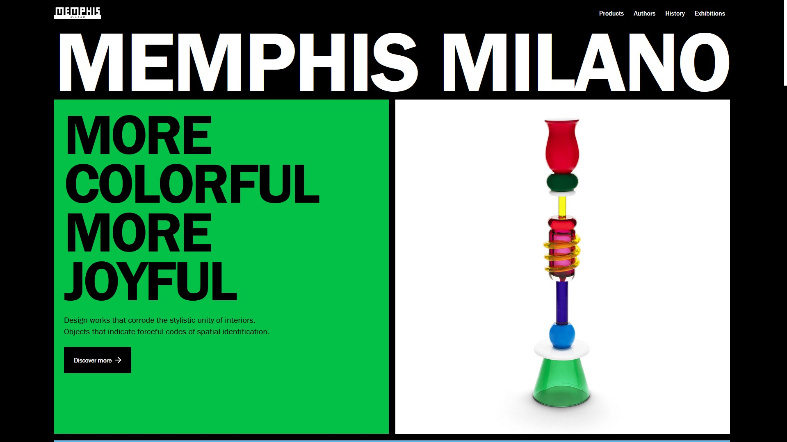

<!-- This template should help get you started developing with Vue 3 in Vite.

## Recommended IDE Setup

[VSCode](https://code.visualstudio.com/) + [Volar](https://marketplace.visualstudio.com/items?itemName=Vue.volar) (and disable Vetur) + [TypeScript Vue Plugin (Volar)](https://marketplace.visualstudio.com/items?itemName=Vue.vscode-typescript-vue-plugin).

## Type Support for `.vue` Imports in TS

TypeScript cannot handle type information for `.vue` imports by default, so we replace the `tsc` CLI with `vue-tsc` for type checking. In editors, we need [TypeScript Vue Plugin (Volar)](https://marketplace.visualstudio.com/items?itemName=Vue.vscode-typescript-vue-plugin) to make the TypeScript language service aware of `.vue` types.

If the standalone TypeScript plugin doesn't feel fast enough to you, Volar has also implemented a [Take Over Mode](https://github.com/johnsoncodehk/volar/discussions/471#discussioncomment-1361669) that is more performant. You can enable it by the following steps:

1. Disable the built-in TypeScript Extension
   1. Run `Extensions: Show Built-in Extensions` from VSCode's command palette
   2. Find `TypeScript and JavaScript Language Features`, right click and select `Disable (Workspace)`
2. Reload the VSCode window by running `Developer: Reload Window` from the command palette.

## Customize configuration

See [Vite Configuration Reference](https://vitejs.dev/config/).

## Project Setup

```sh
npm install
```

### Compile and Hot-Reload for Development

```sh
npm run dev
```

### Type-Check, Compile and Minify for Production

```sh
npm run build
```

### Run Unit Tests with [Vitest](https://vitest.dev/)

```sh
npm run test:unit
```

### Lint with [ESLint](https://eslint.org/)

```sh
npm run lint
``` -->

# Shadow Boxing Workout

_As a boxing enthusiast and adept, I wanted to create a training app based on the most common boxing training - shadow boxing. It was intended to allow users at any level to work on punch combinations, footwork or reflexes even more effectively. The original idea has been developed with additional features to cater to a wider range of users._


# General Info

## Project

A simple platform for those training in boxing or other combat sports aimed at supporting users' training and sports development; building a community and as a source of knowledge and information about the world of boxing. Develop your skills, watch progress, share on socials!

## Features included:

- **The core - Shadow Boxing Workout:** Boxing training sessions divided into levels of difficulty;
- **Weight Monitor:** Recording weight measurements and displaying historical records in a chart format;
- **Blogs:** User blog section (_to be implemented in further stages of project development_);
- **E-commerce Store** Store offering clothing and accessories for combat sports enthusiasts (_to be implemented in further stages of project development_).

## Programming Goals And Assumptions

- **From Scratch to Deployment:** The project aims to build a comprehensive application from the ground up, considering my level of knowledge and experience, based on one of the JavaScript frameworks;
- **Efficient Styling**;
- **Utilizing the cloud platform for handling authentication and user data storage**;
- **Utilizing TypeScript**;
- **Version control and tracking changes in the project**;
- **Responsive Design**;
- **Accessibility**;
- **Unit Testing**;
- **Clean Code**;

## Tech Stack

Built with:

- Vue.js,
- Pinia,
- Vue Router,
- Vite,
- Vitest,
- Firebase,
- Tailwind,
- Typescript,
- Vuelidate,
- Chart.js.

# Result

### From Scratch to Deployment:

The project was created using Vue.js and related libraries and tools such as:

- Pinia,
- Vue Router,
- Vite, etc.
  It is the result of independent work from the idea through the structure, selection of tools and design solutions and their implementation. It is a summary of the consecutive stages of learning programming and an introduction to working with **NUXT**, which is the next designated step.

### Efficient Styling:

After learning about _Bootstrap_, _Sass_, _BEM_, I decided to use **Tailwind CSS** (https://tailwindcss.com/) for this project. The app is fully styled using Tailwind's built-in CSS classes, with no additional CSS classes (scope nor global). In addition, extensions have been created for the custom colors used in the app and a font from Google Fonts has been added. Keyframes were also added and animations were defined. All this allows for better management and easier changes to the code.
Examples of my extensions:

```
      colors: {
        'almost-white': '#E7E4DF',
        'almost-black': '#141414',
        'almost-grey': '#808080',
        (...)
      },
      keyframes:{
        (...),
        'show-down': {
          '0%': {
            transform: 'translateY(-100%)',
            'clip-path': 'inset(100% 0 0 0)'
          },
          '100%': {
            transform: 'translateY(0)',
            'clip-path': 'inset(0)'
          },
        (...)
        },
      },
      animation:{
        (...)
        'appear-slow-and-delayed': 'appearance 1s linear 700ms both',
        (...)
      }
```

### Utilizing the cloud platform for handling authentication and user data storage:

High popularity, good quality documentation and numerous resources and tutorials led me to use the **Firebase** platform (https://firebase.google.com/). The project uses **Authentification** and **Cloud Firestore** products. The built-in Authentification features combined with Pinia allowed me to easily create and save user accounts in the database, log in, reset passwords...

```
actions: {
    // sign up anonymously with firebase
    async getAccessAsAnAnonymous(): Promise<void> {
      try {
        await signInAnonymously(firebaseAuth)
      } catch (error: unknown) {
        this.errorsHandling(error)
      }
    },

    // sign up user via form
    async createUser(email: string, password: string, displayName: string): Promise<void> {
      try {
        const userCredential = await createUserWithEmailAndPassword(firebaseAuth, email, password)
        await updateProfile(userCredential.user, { displayName: displayName })
        await sendEmailVerification(userCredential.user)
      } catch (error: unknown) {
        this.errorsHandling(error)
      }
    },

    // sign in user via form
    async signInUser(email: string, password: string): Promise<void> {
      if (!this.user) {
        try {
          const userCredential = await signInWithEmailAndPassword(firebaseAuth, email, password)
          const authenticatedUser = userCredential.user
          if (authenticatedUser && authenticatedUser.emailVerified) {
            this.user = authenticatedUser
          } else {
            throw new Error('User not authenticated or email not verified.')
          }
        } catch (error: unknown) {
          this.errorsHandling(error)
        }
      }
    },

    // log out current user with firebase
    async logoutUser(
      routerPush: (location: string | RouteLocationNamedRaw) => void
    ): Promise<void> {
      try {
        await signOut(firebaseAuth)
        routerPush({ name: 'home' })
      } catch (error: unknown | FirebaseError) {
        this.errorsHandling(error)
      }
    },
}
```

Firebase helps differentiate the availability of functionality for logged in and anonymous users.
Example:

```
  <router-link
    v-if="authStore.user"
    :to="{ name: 'shadow-boxing', params: { userId: authStore.user.uid } }"
  >
    Shadow Boxing
  </router-link>
```

Users Accessibility Categories:

- **Full Access:** For registered users, the ability to get and post weight measurements and training results, make purchases, save favorite blogs, posts, or create content.
- **Limited Access:** For users without registration, no access to shadow boxing features, weight monitor, purchasing (only browsing), saving favorite blogs (only browsing), posts, or creating content.
- **Try As Guest:** A temporary "Try As Guest" access option has been created to allow interested users to shorten the authentication path and provide access to all functionalities - weight measurements, shadow boxing sessions, etc. The data won't be be stored in the database but only in local memory.

<!-- ADD MORE!!1 -->

### Utilizing TypeScript:

<!-- TO UPDATE -->

### Version control and tracking changes in the project:

<!-- TO UPDATE -->

### Responsive Design:

Responsive interfaces build with Tailwind CSS default breakpoints (https://tailwindcss.com/docs/responsive-design) with extra prefix added:

```
screens: {
        xs: '475px'
      },
```


### Accessibility:

<!-- TO UPDATE -->

### Unit Testing:

<!-- TO UPDATE -->

### Clean Code:

<!-- TO UPDATE -->

# Design Inspirations

#### Webpages

<a href="https://aim.obys.agency/" target="_blank" rel="noopener"></a>
<a href="https://memphis.it/en/" target="_blank" rel="noopener"></a>
<a href="https://www.eclipse.builders/" target="_blank" rel="noopener"></a>

#### Web elements

- https://css-tricks.com/animating-with-clip-path/

#### Icons, Graphics & Photos

- Icons:
  - https://heroicons.com/
  - https://www.flaticon.com/
- Graphics & Photos:
  - https://unsplash.com/
  - punch-figures used in basic training are presented and processed by the author
    <br>
    <br>
    <br>
    <br>
    <br>
    **FOR THE LOVE OF BOXING**
