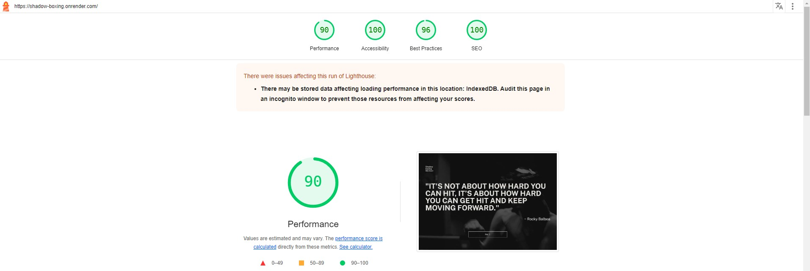

# Shadow Boxing Workout

_As a boxing enthusiast, I wanted to create a training app based on the most common boxing training - shadow boxing. It was intended to allow users at any level to work on punch combinations, footwork or reflexes even more effectively. The original idea has been developed with additional features to cater to a wider range of users._


# Table of content.

1. [**Introduction**](#Introduction)
   - [**Features**](#main-elements-and-features)
   - [**Tech Stack**](#tech-stack)
   - [**Installing**](#installing)
2. **Programming goals and results linked to set objectives**
   - [**From scratch to deployment**](#from-scratch-to-deployment)
   - [**Efficient styling**](#efficient-styling)
   - [**Utilizing the cloud platform for handling authentication and user data storage**](#utilizing-the-cloud-platform-for-handling-authentication-and-user-data-storage)
   - [**Utilizing TypeScript**](#utilizing-typescript)
   - [**Version control and tracking changes in the project**](#version-control-and-tracking-changes-in-the-project)
   - [**Responsive design**](#responsive-design)
   - [**Accessibility**](#Accessibility)
   - [**Code testing**](#code-testing)
3. [**Firebase**](#firebase)
   - [**Authentication**](#authentication)
     - [**Accessibility categories**](#accessibility-categories)
   - [**Firestore Database**](#firestore-database)
   - [**Firebase Storage**](#firebase-storage)
4. [**Form validation - Vuelidate**](#form-validation---vuelidate)
5. [**Issues & conclusions**](#issues--conclusions)
6. [**Performance**](#performance)
7. [**Design inspirations**](#design-inspirations)

# Introduction

## Project idea.

A simple platform for those training in boxing or other combat sports aimed at supporting users' training and sports development; building a community and as a source of knowledge and information about the world of boxing.

## Main elements and features.

1. Implemented:

- **Shadow Boxing Workout**

  - _Feature_: The core feature: boxing training sessions divided into levels of difficulty;
  - _Usage_: Users can set up training sessions at various levels and practice different elements of boxing by following displayed and audio commands based on the shadow boxing numbering system. This system aids in remembering and developing winning combinations, with even-numbered punches being right-hand punches and odd-numbered punches being left-hand punches.

  - **Basic level**:

    - set punches amount per session,
    - set intensity (time span between following commands),
    - set display mode (digits or icons).
    - Suitable for beginners and those who are looking for a less intense workout,
    - Focuses on basic combinations and slower pace to help users grasp fundamental movements,
    - Audio commands and simplified figure which demonstrates each punch, making it easier to follow along

  - **Advanced level**:

    - set amounts of rounds,
    - set complexity (amount of punches in each combo),
    - set intensity (time span between following combos).
    - Designed for advanced users aiming for a high-intensity workout,
    - Emphasizes rapid movements and more complex combinations,
    - Audio commands allows helps users to stay focused on the movements.

- **Weight Monitor**
  - _Feature_: Recording weight measurements and displaying historical records in a chart format;
  - _Usage_: Users can regularly save their weight measurements. These measurements are stored externally and displayed as a chart with additional info such as current weight, max weight, min weight, and progress/regress compared to the previous measurement. This helps users track their progress over time.

2. To be implemented in further stages of the development:

- **Blogs**

  - _Feature_: User's blog section;
  - _Usage_: Users can create blogs - sharing experiences and various content about boxing, fitness or martial arts. Readers can give kudos, add posts to favorites and follow favorite authors.

- **E-commerce Store**

  - _Feature_: Store offering clothing and accessories for combat sports enthusiasts.
  - _Usage_: Users can browse and buy clothes or accessories from the dedicated brand "średnio".

## Tech Stack.

Built with:

- **Vue.js**,
- **Pinia**,
- **Vue Router**,
- **Vite**,
- **Vitest**,
- **Firebase**,
- **Tailwind CSS**,
- **Typescript**,
- **Vuelidate**,
- **Chart.js**,
- **Vue Test Utils**,
- **Testing Library**.

## Installing

### Recommended IDE Setup

[VSCode](https://code.visualstudio.com/) + [Volar](https://marketplace.visualstudio.com/items?itemName=Vue.volar) (and disable Vetur) + [TypeScript Vue Plugin (Volar)](https://marketplace.visualstudio.com/items?itemName=Vue.vscode-typescript-vue-plugin).

### Type Support for `.vue` Imports in TS

TypeScript cannot handle type information for `.vue` imports by default, so we replace the `tsc` CLI with `vue-tsc` for type checking. In editors, we need [TypeScript Vue Plugin (Volar)](https://marketplace.visualstudio.com/items?itemName=Vue.vscode-typescript-vue-plugin) to make the TypeScript language service aware of `.vue` types.

If the standalone TypeScript plugin doesn't feel fast enough to you, Volar has also implemented a [Take Over Mode](https://github.com/johnsoncodehk/volar/discussions/471#discussioncomment-1361669) that is more performant. You can enable it by the following steps:

1. Disable the built-in TypeScript Extension
   1. Run `Extensions: Show Built-in Extensions` from VSCode's command palette
   2. Find `TypeScript and JavaScript Language Features`, right click and select `Disable (Workspace)`
2. Reload the VSCode window by running `Developer: Reload Window` from the command palette.

### Customize configuration

See [Vite Configuration Reference](https://vitejs.dev/config/).

### Project Setup

```sh
npm install
```

#### Compile and Hot-Reload for Development

```sh
npm run dev
```

#### Type-Check, Compile and Minify for Production

```sh
npm run build
```

#### Run Unit Tests with [Vitest](https://vitest.dev/)

```sh
npm run test
```

#### Lint with [ESLint](https://eslint.org/)

```sh
npm run lint
```

# Programming goals and results linked to set objectives.

1.  ## **From Scratch to Deployment**

    The project aims to build a comprehensive application from the ground up, considering my level of knowledge and experience, based on one of the JavaScript frameworks;
    The project was created using Vue.js and related libraries and tools such as:

    - Pinia,
    - Vue Router,
    - Vite, etc.

    It is the result of independent work from the idea through the structure, selection of tools and design solutions and their implementation. It is a summary of the consecutive stages of learning programming and an introduction to working with NUXT, which is the next designated step.

2.  ## **Efficient Styling**

    During my training of CSS I learned how to effectively use:

    - Bootstrap,
    - Sass,
    - BEM;

    For this project I decided to use **Tailwind CSS** (https://tailwindcss.com/). The app is fully styled using Tailwind's built-in CSS classes, with no additional CSS classes (scope nor global).
    In addition I've made some extensions, such as:

    - custom colors,
    - custom font (Google Fonts),
    - custom keyframes,
    - defined animations.

    Examples of my extensions:

    ```ts
    // tailwind.config.ts
       colors: {
         'custom-white': '#E7E4DF',
         'custom-black': '#141414',
       },
       keyframes:{
         'show-down': {
           '0%': {
             transform: 'translateY(-100%)',
             'clip-path': 'inset(100% 0 0 0)'
           },
           '100%': {
             transform: 'translateY(0)',
             'clip-path': 'inset(0)'
           },
         },
       },
       animation:{
         'appear-slow-and-delayed': 'appearance 1s linear 700ms both',
       }
    ```

3.  ## **Utilizing the cloud platform for handling authentication and user data storage**

    High popularity, good quality documentation and numerous resources and tutorials led me to use the **Firebase** platform (https://firebase.google.com/). The built-in features combined with **Pinia** allowed me to easily manage many aspects such as:

    - Creating / Logging in users,
    - Controlling access to selected services,
    - Storing users data (weight measurements, training sessions history),
    - Storing sources like audio files for training sessions;

    Products I used in the project:

    - Firebase Authentication,
    - Firebase Storage,
    - Firestore Database;

    See more in [**Firebase**](#firebase) section.

4.  ## **Utilizing TypeScript**

    TypeScript is now a 'must have' for any programmer writing in JavaScript. Working on this project was an opportunity to learn and use it in a real project. I used basic elements such as:

    - **Type Annotation**
      Type annotations are crucial as they provide greater typing certainty and helped me avoid errors related to data types. In this project, I used type annotations to declare data types for variables, making it easier to understand their intentions and preventing errors during programming.

    ```ts
    // BasicTrainingModal.vue
    const punchesArray: string[] = [
      'jab',
      'cross',
      'lead hook',
      'rear hook',
      'lead uppercut',
      'rear uppercut'
    ]
    ```

    - **Interfaces** are used in the project mainly to define data structures and improve code readability and maintainability. By defining interfaces for different data types, such as quotes or user data, I was able to clearly specify which properties should be present in objects implementing these interfaces.

    ```ts
    // quotes.ts
    interface Quote {
      quote: string
      author: string
    }
    ```

    - **Type guards** are essential in the project for handling various data types, including errors related to the Firebase service. With type guards, I was able to safely handle different data cases and prevent errors caused by type inconsistencies.

    ```ts
    // AuthenticationStore.ts
        errorsHandling(error: unknown | FirebaseError) {
          if (error instance of FirebaseError) {
            console.error('Firebase Error:', error.code, error.message)
            switch (error.code) {...}
          } else {
            console.error('Unexpected Error:', error)
            switch (error) {...}
            throw new Error('Unexpected Error')
          }
        }
    ```

    - **Union types** are used in the project to handle different use cases and conditions that may arise. They allow to specify a variable or function parameter that can have multiple possible types.

    ```ts
    // BasicTrainingModal.vue
    const intervalId = ref<number | null>(null)
    ```

    - **Generics** are used in the project to create more generic and reusable components, functions, or classes. Thanks to Generics I was able to write code that can operate on different data types, contributing to code flexibility and reusability:

    ```ts
    interface WeightGraphProps {
      measurements: WeightData[]
    }
    const props = defineProps<WeightGraphProps>()
    ```

5.  ## **Version control and tracking changes in the project**

    - I used **Git** for version control to organize the source code.
    - Since it's my personal project and there were no other persons involved, I decided to create only one **branch**. I didn't use any pull requests, but I reviewed changes locally.
    - The repository was regularly updated with clear and descriptive **commits**.
    - Built-in **Source Control** was used for the repository management.
    - The project includes a **.gitignore** file to ignore Firebase configuration data. Additionally, an **env.example** file is included to indicate the configuration structure.

6.  ## **Responsive design**

    Elements that allows to display application on various devices:

    - **Responsive Breakpoints**: default Tailwind CSS breakpoints (https://tailwindcss.com/docs/responsive-design), expanded by an extra size - "xs": 475px to control responsiveness on smallest screens;
    - **No hard-coded font sizes**: I used default Tailwind CSS sizes or used rem units;
    - **Mobile navigation**: User sees a different navigation menu depending on device screen size;
    - **Content display adjustment**: Depending on device screen some elements may not occur (background images for instance) or may have different form (weight measurements detail boxes).

    Responsiveness tested on web browsers as follows:

    - Google Chrome,
    - Mozilla Firefox,
    - Microsoft Edge,
    - Brave,

    Home View on various devices below.
    

7.  ## **Accessibility**

    The project takes into account the guidelines for accessibility improvements (**WCAG**) and allows users with various disabilities to use the application. To improve the user experience, I created 'basic' mode for the shadow boxing training. It provides not only voice commands but also displays the current punch name and descriptive icon. Thanks to this, almost all users may experience benefit of the shadow boxing training.  
    Basic Training Screen:
    

    Elements that improve Accessibility:

    - Tabbable interactive elements;
    - Proper color contrast between text and background;
    - Scalable text, up to 200%, without loss of functionality;
    - Alt-text for images and graphic elements;
    - Clear and readable font with no hard-coded font sizes;
    - Usage of ARIA tags such as aria-label, aria-hidden, aria-placeholder, aria-live, role, etc.

    Code example with _ARIA_:

    ```vue
    <!-- LoginForm.vue -->
    <!-- ERROR DISPLAY -->
    <p
      class="text-red-500 py-3 text-left llg:mb-5 h-36"
      aria-label="Error Message Display"
      aria-live="assertive"
      role="alert"
    >
          {{ authStore.authError }}
        </p>
    ```

    Accessibility checking tools used:

    - Lighthouse (Chrome),
    - Equal Web Accessibility Checker (Brave),
    - Wave Evaluation Tool (Firefox).

8.  ## **Code testing**

    For testing my project I used Vitest (https://vitest.dev/), which is dedicated testing framework for Vue.js.
    Libraries I used for testing:

    - Vue Test Utils (https://test-utils.vuejs.org/guide/);
    - Testing Library (https://testing-library.com/);
    - Vue-router-mock (https://github.com/posva/vue-router-mock);

9.  ## **Clean code**

    Due to the nature of the project, the code doesn't rely on complicated algorithms - it's mostly about computing training setup and/or handling user's data.
    Vue.js and Firebase provide many build-in solutions that helps keep the code clean.
    Nevertheless, I've tried to keep my code well-organized, readable and in line with main rules like:

    - descriptive naming,
    - code formatting,
    - KISS (Keep it Simple, Stupid),
    - DRY(Don't repeat yourself),
    - Creating shared functions and components,
    - adding comments,

    Examples:

    - Descriptive naming of functions and components shows clearly specific role of each element:
      - Helpers function: punchIconsHandler.ts
      - Component: PauseResumeButton.vue;
    - Code formatting (ESLint, Prettier extensions) to keep the code readable, adding comments to provide helpful information about the code, constant finning it to get the most effective and optimized code,
    - Splitting buttons and their functionalities into separate components helps keep the code simple (KISS), each component holds only a single responsibility, making the code easier to manage (Single Responsibility Principle - SOLID) and allowing to reuse in different parts of the code (DRY):

           Example A:

           ```vue
           <!-- Save&CloseButton.vue -->
           <template>
             <button
               @click="saveAndCloseSession(saveSession)"
               class="row-start-1 row-span-1 py-4 w-full group tracking-wide bg-custom-orange-dark"
             >
               <button-label labelText="Save & Close" />
             </button>
           </template>
           <script setup lang="ts">
           import ButtonLabel from '@/components/shared/ButtonLabel.vue'
           import { changeRoute } from './helpers/changeRoute'
           import { useRouter } from 'vue-router'
           const router = useRouter()

           const saveAndCloseSession = (saveSession: () => void): void => {
             saveSession() // SAVE SESSION TO FIREBASE HERE
             changeRoute(router, 'shadow-boxing')
           }
           defineProps<{
             saveSession: () => void
           }>()
           </script>
           ```

           Example B:
           ```vue
           <!-- SignUpForm.vue -->
           <!-- FORM INPUTS -->
           <div
             v-for="(section, index) in formSection"
             :key="index"
             class="md:col-span-5 animate-text-show-up"
           >
              <!-- DISPLAYNAME, EMAIL, PASSWORD, PASSWORD CONFIRMATION INPUTS -->
              <label class="text-xl capitalize" :for="section.id">{{ section.title }}</label>
              <input
                @blur="section.blur"
                :id="section.id"
                v-model="section.value"
                :type="section.type"
                :placeholder="section.placeholder"
                :aria-placeholder="section.placeholder"
                class="h-10 text-lg my-1 px-5 w-full bg-custom-white border-none placeholder:text-custom-grey      text-custom-black"
              />

            </div>
            <!-- form sections including vuelidate userData values const formSection = ref -->
            <signUpFormSection[]></signUpFormSection[]>

            ```

# Firebase

1. ## Authentication

   ```ts
   // AuthenticationStore.ts
   actions: {
    // sign up anonymously with firebase
    async getAccessAsAnAnonymous(): Promise<void> {
      try {
        await signInAnonymously(firebaseAuth)
      } catch (error: unknown) {
        this.errorsHandling(error)
      }
    },

    // sign up user via form
    async createUser(email: string, password: string, displayName: string): Promise<void> {
      try {
        const userCredential = await createUserWithEmailAndPassword(firebaseAuth, email, password)
        await updateProfile(userCredential.user, { displayName: displayName })
        await sendEmailVerification(userCredential.user)
      } catch (error: unknown) {
        this.errorsHandling(error)
      }
    },

    // sign in user via form
    async signInUser(email: string, password: string): Promise<void> {
      if (!this.user) {
        try {
          const userCredential = await signInWithEmailAndPassword(firebaseAuth, email, password)
          const authenticatedUser = userCredential.user
          if (authenticatedUser && authenticatedUser.emailVerified) {
            this.user = authenticatedUser
          } else {
            throw new Error('User not authenticated or email not verified.')
          }
        } catch (error: unknown) {
          this.errorsHandling(error)
        }
      }
    },

    // log out current user with firebase
    async logoutUser(
      routerPush: (location: string | RouteLocationNamedRaw) => void
    ): Promise<void> {
      try {
        await signOut(firebaseAuth)
        routerPush({ name: 'home' })
      } catch (error: unknown | FirebaseError) {
        this.errorsHandling(error)
      }
    },
   }
   ```

**Firebase** helps differentiate the availability of functionality for logged-in and anonymous users, for example rendering/not rendering nav items depending on user status.

```vue
 <!-- ShadowBoxingLink.vue -->
<router-link
// display menu item if the user exist and is authenticated / change route to 'shadow-boxing'
 v-if="authStore.user"
 :to="{ name: 'shadow-boxing', params: { userId: authStore.user.uid } }"
>
  Shadow Boxing
 </router-link>

```

### Accessibility Categories

Created Users accessibility categories:

- **Full Access:** For registered users:

  - [x] To get and post weight measurements,
  - [x] Save training results;

  To be implemented in further stages of the project development:

  - [x] Make purchase in e-store,
  - [x] Save favorite blogs, posts,
  - [x] Create and publish on blogs section.

- **Limited Access:** For users without registration:

  - [x] Access denied to training section & weight monitor;

  To be implemented in further stages of the project development:

  - [x] Limited access to blog section (only reading, no creating, no adding to favorite),

- **Try As Guest:** A temporary access option:
  - [x] Allow interested users to shorten the authentication path and provide access to all functionalities. The data will be stored in Database but user will lose the access to it after logging out.

2. ## Firestore Database

   Saving & getting training sessions data or weight monitor measurements:

   ```ts
   // WeightInput.vue
   // Submit weight value to firebase user's data collection
   const populateWeights = async (): Promise
   <void></void>
   ```

   ```ts
   // WeightMonitorView.vue
   // get measurements data collection related to current user
   const getMeasures = async (): Promise<void> => {
     if (authStore.user != null) {
       const measurementsCollection = collection(db, 'users', authStore.user.uid, 'measurements')
       q = query(measurementsCollection, orderBy('date'))
       try {
         const querySnapshot = await getDocs(q)
         measurements.value = mapSnapshot(querySnapshot.docs)
       } catch (error) {
         console.error('getMeasures error: ' + error)
       }
     }
   }
   ```

   ```ts
   // AdvancedTrainingDisplay.vue
   // submit session details to firebase user's data collection
   const saveAndCloseSession = async (): Promise<void> => {
     const user = authStore.user
     if (user && advTrainingStore.status === 'done') {
       try {
         // according to firebase docs: function creates records in 'trainings' folder
         const trainingCollection = collection(db, 'users', user.uid, 'trainings')
         await addDoc(trainingCollection, {
           training: 'advanced',
           rounds: advTrainingStore.rounds,
           complexity: advTrainingStore.complexity,
           intensity: advTrainingStore.intensity,
           // record keeps weight value & date of creation
           date: new Date()
         })
       } catch (error) {
         console.error('Saving Advanced Training Session Error:' + error)
       }
     }
   }
   ```

3. ## Firebase Storage
   Firebase Storage is used for storing audio files used during training sessions:
   ```ts
   // advancedAudioCombinationsHandler.ts
   const getAudioFiles = async (): Promise<void> => {
     try {
       const audioFiles = await listAll(folderRef)
       for (const itemRef of audioFiles.items) {
         try {
           const url = await getDownloadURL(itemRef)
           combinationsArray.push(url)
         } catch (error) {
           console.error('Error downloading advanced combinations audio files:' + error)
         }
       }
     } catch (error: unknown) {
       console.error('Error listing files:' + error)
     }
   }
   ```

# Form validation - Vuelidate

For "Create an account" form I used Vuelidate (https://vuelidate-next.netlify.app/) - lightweight model-based validation dedicated for Vue.js.
Vuelidate comes with a set of validators which I set up in the code.
Validators I used are responsible for matching values of password and password-confirmation property, email input control, required min. length:

```ts
// SignUpForm.vue
// validation rules (due to Vuelidate docs)
const validationRules = computed(() => {
  return {
    displayName: { required, alphaNum, minLength: minLength(2) },
    email: { required, email },
    password: {
      password: {
        required,
        minLength: minLength(8)
      },
      confirm: { required, sameAs: sameAs(userData.password.password) }
    }
  }
})
```

This validator also helps to generate error messages displayed to the _user.$touch_ method and _@blur_ event causing that error only shows up after user entered and left the input.

```ts
// SignUpForm.vue
  // for email / with validation
  {
    title: 'email',
    blur: () => v$.value.email.$touch(),
    id: 'email',
    value: userData.email,
    type: 'email',
    placeholder: 'rocky.balboa@mail.com',
    error: () => v$.value.email.$error,
    errorMessage: () => v$.value.email.$errors[0].$message
  },
```

It also helps to avoid sending incorrect or empty form to Firebase:

```ts
// SignUpForm.vue
// check if no vuelidate errors or empty fields before sending request to firebase
if (!v$.value.$error || !v$.value.$invalid) return
```

# Issues & Conclusions

- **Accessibility**

  - Due to the specific nature of the boxing training, some functionalities are not fully accessible to users with various disabilities. The advanced training mode doesn't provide any visual display of the punch commands that the user hears. This element requires further development;
  - Router Links are not tabbable properly. All router links are working correctly while navigating by 'Tab' by user but don't see outline or any visual sign of focus. Adding additional tailwind classes didn't help. **WAVE** (web accessibility evaluation tool) didn't recognized this as an error. This element need further development;

- **Clean Code**

  - I used the _v-for_ loop Vue built-in directive for authentication form inputs (log-in & sign-up). This method seems a bit difficult for me to read and manage when combined with _v-model_ and **Vuelidate**. I feel more comfortable with the longer version, like the one I used in the Weight Monitor Details Section:

  ```ts
  // WeightMonitorView.vue
   <div class="grid grid-rows-5 md:grid-rows-none md:grid-cols-5 h-full pt-9 gap-px">
      <stats-box
        title="Current weight:"
        :value="computedDetails.lastMeasure"
        class="animate-text-show-up"
      />
      <stats-box
        title="Progress / regress:"
        :value="computedDetails.progress"
        class="animate-text-show-up-02"
        :valueColor="computedDetails.progress > 0 ? 'text-red-500' : 'text-green-500'"
      />
      <stats-box
        title="Lowest weight:"
        :value="computedDetails.minValue"
        class="animate-text-show-up-03"
      />
      <stats-box
        title="Highest weight:"
        :value="computedDetails.maxValue"
        class="animate-text-show-up-02"
      />
      <stats-box
        title="Average weight:"
        :value="computedDetails.avgValue"
        class="animate-text-show-up"
      />
    </div>
  ```

- **Firebase**
  Getting audio-command files from Firebase. I mixed the way that audio files are stored and used - For 'basic' session it's stored in 'assets' folder. For 'advanced' session it's stored and downloaded from Firebase storage. I did it on purpose to try both ways and see how it influence on the performance. I'm considering to store all audio files on Firebase storage.

# Performance

The project is published via Render cloud infrastructure. (https://render.com/). After publishing, Google's Lighthouse was used to check the performance,quality and correctness of the project.


# Design Inspirations

## Webpages

<a href="https://aim.obys.agency/" target="_blank" rel="noopener noreferrer"></a>
<a href="https://memphis.it/en/" target="_blank" rel="noopener noreferrer"></a>
<a href="https://www.eclipse.builders/" target="_blank" rel="noopener noreferrer"></a>

## Elements

- https://css-tricks.com/animating-with-clip-path/

## Icons, Graphics & Photos

- Icons:
  - https://heroicons.com/
  - https://www.flaticon.com/
- Graphics & Photos:
  - https://unsplash.com/
  - Punch-figures used in basic training are presented and processed by myself.
    <br>
    <br>
    <br>
    <br>
    <br>
    **FOR THE LOVE OF BOXING**

```

```

```

```
